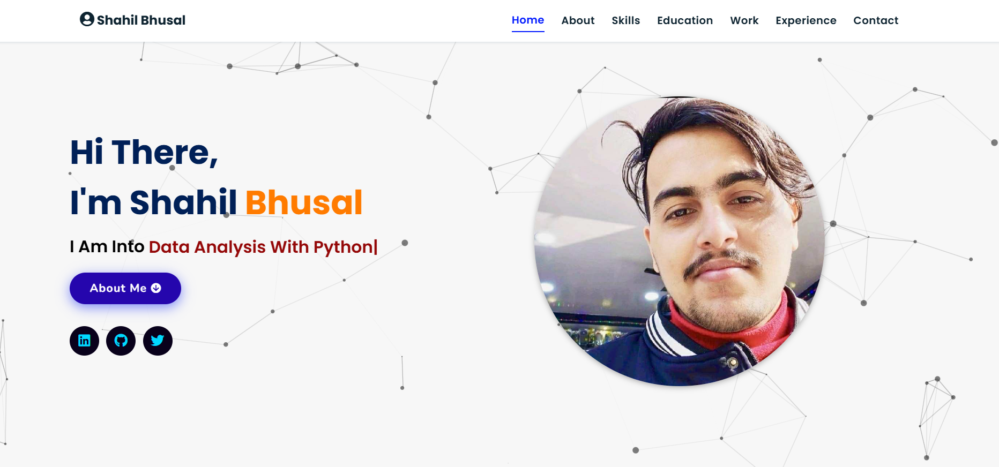

# Portfolio Website



live demo:https://myportfolio37.vercel.app/

This is the personal portfolio website of **Shahil Bhusal**. It showcases my skills, education, experience, and projects through a clean, responsive, and user-friendly interface.

---

## Features

- **Skills:** A detailed list of technical skills and tools I am proficient in.
- **Education:** My academic background including degrees and certifications.
- **Experience:** Internship and job experience with descriptions of roles and responsibilities.
- **Projects:** A showcase of my projects with images, descriptions, and links to live demos and source code.
- **Responsive Design:** Works seamlessly on desktops, tablets, and mobile devices.
- **Smooth Animations:** Interactive UI elements with smooth transitions and animations.

---

## Technologies Used

- HTML5
- CSS3 (Flexbox, Grid)
- JavaScript (ES6+)


## How to Run

1. Clone the repository:
   ```bash
   git clone https://github.com/shahil8848/Protfolio.git
